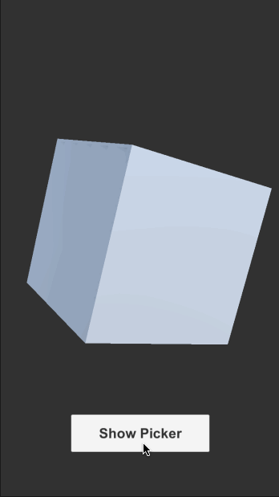
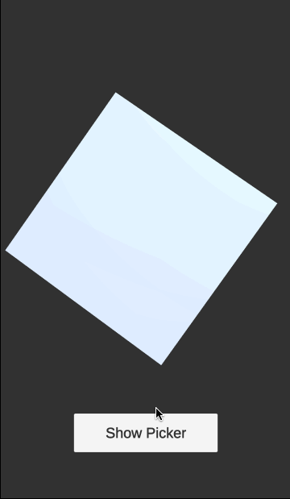

# unimgpicker

Image picker for Unity iOS/Android




## Getting Started

Import `unimgpicker.unitypackage` into your project.

:warning: For package developers: This project is under work to adapt with Package Manager. Please use `.unitypackage` until the migration is done.

Define Photo Library Usage Description on `Unimgpicker/Editor/NSPhotoLibraryUsageDescription.txt`

ex: **Unimgpicker/Editor/NSPhotoLibraryUsageDescription.txt**

```
Use the image to create your profile.
```

## Demo

Read image, create texture and render it on the Cube(MeshRenderer).

```csharp
using UnityEngine;
using System.Collections;

namespace Kakera
{
    public class PickerController : MonoBehaviour
    {
        [SerializeField]
        private Unimgpicker imagePicker;

        [SerializeField]
        private MeshRenderer imageRenderer;

        void Awake()
        {
            // Unimgpicker returns the image file path.
            imagePicker.Completed += (string path) =>
            {
                StartCoroutine(LoadImage(path, imageRenderer));
            };
        }

        public void OnPressShowPicker()
        {
            // With v1.1 or greater, you can set the maximum size of the image
            // to save the memory usage.
            imagePicker.Show("Select Image", "unimgpicker", 1024);
        }

        private IEnumerator LoadImage(string path, MeshRenderer output)
        {
            var url = "file://" + path;
            var www = new WWW(url);
            yield return www;

            var texture = www.texture;
            if (texture == null)
            {
                Debug.LogError("Failed to load texture url:" + url);
            }

            output.material.mainTexture = texture;
        }
    }
}
```

## Environment

The code is developed on following environments. Note that these are NOT minimum version requirements.

| Platform | OS |  IDE |
| --- | --- | --- |
| iOS | 13.3 | Xcode 11.6 |
| Android | 10.0 (API 29) | Android Studio 4.0.1 |

### Minimum SDK Versions

| Platform | SDK Version |
| --- | --- |
| Android | 6.0 (API 23) |

## For Developers

### Running formatter

```sh
# If clang-format is installed.
$ make format

# If docker is installed.
$ docker build -t unimgpicker .
$ docker run --rm -v $PWD:/build -w /build unimgpicker make format
```

### Customize Unimgpicker by Self

Unimgpicker embedds Obj-C & Java code as Unity plugin.
You can make changes to the code.
