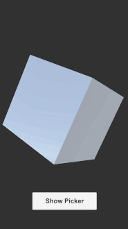

# unimgpicker

Image picker for Unity iOS/Android




## Getting Started

Define Photo Library Usage Description on `Unimgpicker/Editor/NSPhotoLibraryUsageDescription.txt`

ex: **Unimgpicker/Editor/NSPhotoLibraryUsageDescription.txt**

```
Use the image to create your profile.
```

## Build

When you build an APK, you have to set build system to `Gradle (New)`.
This is because Unimgpicker requires `exifinterface` support library.

If your build fails due to SDK version conflicts, edit `build.gradle` in Unimgpicker directory.

## Demo

Read image, create texture and render it on the Cube(MeshRenderer).

```csharp
using UnityEngine;
using System.Collections;

namespace Kakera
{
    public class PickerController : MonoBehaviour
    {
        [SerializeField]
        private Unimgpicker imagePicker;

        [SerializeField]
        private MeshRenderer imageRenderer;

        void Awake()
        {
            // Unimgpicker returns the image file path.
            imagePicker.Completed += (string path) =>
            {
                StartCoroutine(LoadImage(path, imageRenderer));
            };
        }

        public void OnPressShowPicker()
        {
            // With v1.1 or greater, you can set the maximum size of the image
            // to save the memory usage.
            imagePicker.Show("Select Image", "unimgpicker", 1024);
        }

        private IEnumerator LoadImage(string path, MeshRenderer output)
        {
            var url = "file://" + path;
            var www = new WWW(url);
            yield return www;

            var texture = www.texture;
            if (texture == null)
            {
                Debug.LogError("Failed to load texture url:" + url);
            }

            output.material.mainTexture = texture;
        }
    }
}
```

## For Plugin Developers

### Dependency

The Android plugin project depends on OSX.
Because it loads `classes.jar` from the Unity Application path.

### Export

Build jar with a gradle task at `./unimgpicker_android`.

```sh
./gradlew unimgpicker:exportJar
```
